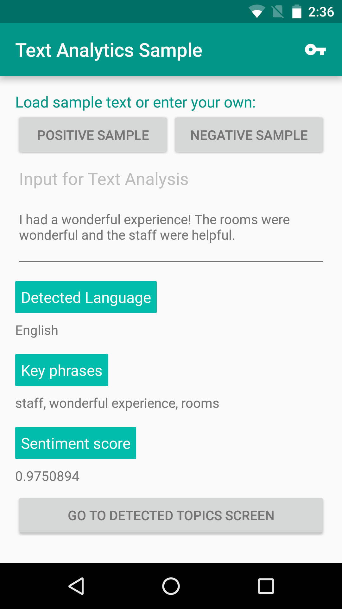
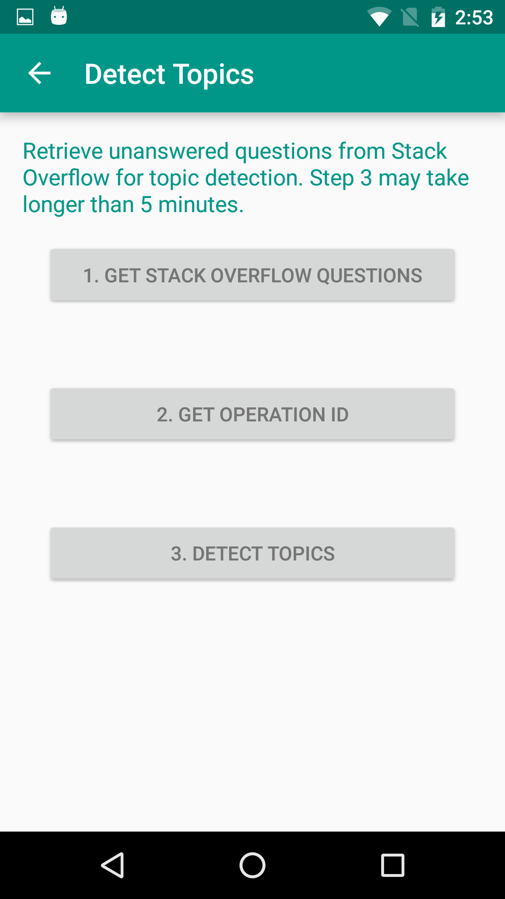

# Microsoft Text Analytics API: Android Client Library & Sample
This repo contains the Android client library & sample for the Microsoft Text Analytics API, an offering within [Microsoft Cognitive Services](https://www.microsoft.com/cognitive-services), formerly known as Project Oxford.
* [Learn about the Text Analytics API](https://www.microsoft.com/cognitive-services/en-us/text-analytics-api)
* [Read the documentation](https://www.microsoft.com/cognitive-services/en-us/text-analytics/documentation)

## The Client Library
The client library is a thin Java client wrapper for the Text Analytics API.

To consume the client library, clone this repo and add the ClientLibrary module to your project

## The Sample
This sample is an Android application to demonstrate the use of the Text Analytics API. It detects the language, key phrases and sentiment of the text. It also detect the topics from a number of documents (at least 100).

### Requirements
Android OS must be Android 4.1 or higher (API Level 16 or higher)

### Build the Sample
1. First, you must obtain a Text Analytics API subscription key by [following the instructions on our website](<https://www.microsoft.com/cognitive-services/en-us/sign-up>).

2.  Start Android Studio and open the downloaded project.

3.  In Android Studio -\> "Project" panel -\> "Android" view, open file
    "Sample/res/values/strings.xml", and find the line
    "Please\_add\_the\_subscription\_key\_here;". Replace the
    "Please\_add\_the\_subscription\_key\_here" value with your subscription key
    string from the first step. If you cannot find the file "strings.xml", it is
    in folder "Sample\app\src\main\res\values\string.xml".

4.  In Android Studio, select menu "Build \> Make Project" to build the sample, and "Run" to launch this sample app.

### Run the Sample
In Android Studio, select menu "Run", and "Run app" to launch this sample app.

Once the app is launched, follow the instructions on screen.

## Contributing
We welcome contributions. Feel free to file issues and pull requests on the repo and we'll address them as we can. Learn more about how you can help on our [Contribution Rules & Guidelines](</CONTRIBUTING.md>). 

You can reach out to us anytime with questions and suggestions using our communities below:
 - **Support questions:** [StackOverflow](<https://stackoverflow.com/questions/tagged/microsoft-cognitive>)
 - **Feedback & feature requests:** [Cognitive Services UserVoice Forum](<https://cognitive.uservoice.com>)

This project has adopted the [Microsoft Open Source Code of Conduct](https://opensource.microsoft.com/codeofconduct/). For more information see the [Code of Conduct FAQ](https://opensource.microsoft.com/codeofconduct/faq/) or contact [opencode@microsoft.com](mailto:opencode@microsoft.com) with any additional questions or comments.

## License
All Microsoft Cognitive Services SDKs and samples are licensed with the MIT License. For more details, see
[LICENSE](</LICENSE.md>).

Sample images are licensed separately, please refer to [LICENSE-IMAGE](</LICENSE-IMAGE.md>).

## Developer Code of Conduct
Developers using Cognitive Services, including this client library & sample, are expected to follow the “Developer Code of Conduct for Microsoft Cognitive Services”, found at [http://go.microsoft.com/fwlink/?LinkId=698895](http://go.microsoft.com/fwlink/?LinkId=698895).
